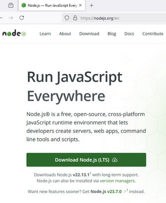
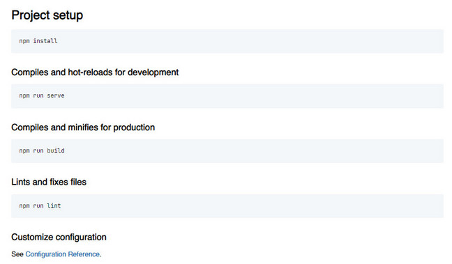

# Фреймворк Vue.js. Обучение в записи

# Урок 8. Семинар: Vue cli
## Работа с макетом

Установить и настроить Vue CLI.<br>
Перевести свой проект (работа с макетом) на Vue CLI. <br>
Все компоненты, которые создали с помощью vue.components, <br>
необходимо переделать на синтаксис Vue CLI.

<br>

#### Задание по работе с макетом направлено на подготовку проекта к итоговой аттестации.

<br>
<br>

#### Формат сдачи: ссылка на гитхаб.

<br><br><br><br>

## Решение и выполнение работы

<br>

Проект на компонентах Vue.js версии 2 - решение для небольших проектов, это набор файлов HTML, CSS и JavaScript, где компоненты Vue.js<br> 
подключаются и регистрируются глобально с Vue.component глобально.<br>
С развитием проекта и расширением его возможности, с увеличением подключаемых зависимостей и технологий, требуется масштабируемость.<br>
Упрощается разработка, сборка и развертывание Vue.js приложений с помощью Vue CLI (Command Line Interface).<br>
Vue CLI предоставляет собственную структуру проекта, где используется система сборки webpack, которая оптимизирует код, <br>
управляет зависимостями и предоставляет другие полезные функции.<br>
Vue CLI создает структурированный проект с разделением на компоненты, представления (pages), хранилище состояний (store) и другие модули.<br>
Задействованы инструменты разработки для горячей перезагрузки (hot-reload), тестирования, линтинга и других аспектов. <br>

### Список наиболее популярных опций Vue CLI для разработчиков:

1. **Babel** - это компилятор JavaScript, который позволяет использовать новейшие возможности языка (ES6+) в старых браузерах, обеспечивая совместимость вашего кода. Vue CLI интегрирует Babel по умолчанию, поэтому вам не нужно настраивать его вручную.
2. **ESLint** - инструмент для статического анализа кода, который помогает выявлять проблемы стиля кода, потенциальные ошибки и несоответствия лучшим практикам. Vue CLI предлагает опцию установки ESLint при создании проекта, что позволяет сразу же начать писать чистый и поддерживаемый код.
3. **Hot Reload** (горячая перезагрузка) - это функция, которая автоматически обновляет страницу в браузере при изменении кода, без необходимости перезагружать ее вручную. Это значительно ускоряет процесс разработки и делает его более комфортным. Hot Reload включен по умолчанию в Vue CLI.
4. **Vue Loader** - загрузчик для Webpack, который позволяет писать компоненты Vue в формате Single-File Components (SFC), где HTML, CSS и JavaScript находятся в одном файле. Vue Loader обеспечивает поддержку горячей перезагрузки, предварительную обработку CSS и другие полезные функции.
5. **Webpack** - сборщик модулей, который объединяет все ваши JavaScript, CSS и другие файлы в один или несколько оптимизированных файлов. Vue CLI использует Webpack под капотом, предоставляя удобный интерфейс для управления им.
6. **Vue Router** - это официальный маршрутизатор для Vue.js, который позволяет создавать одностраничные приложения (SPA) с навигацией по страницам без перезагрузки страницы. Vue CLI предлагает опцию установки Vue Router при создании проекта.
7. **Vuex** - централизованное хранилище состояния для Vue.js приложений. Vue CLI предлагает опцию установки Vuex при создании проекта, что упрощает управление состоянием в сложных приложениях.
8. **Тестирование** Vue CLI предоставляет возможность установки инструментов для тестирования, таких как Jest или Mocha, что позволяет писать автоматические тесты для вашего кода и обеспечить его качество.
9. **Production Build** Vue CLI предоставляет команду npm run build, которая создает оптимизированную сборку вашего приложения для production. Эта сборка включает минификацию кода, удаление ненужных файлов и другие оптимизации для улучшения производительности.
10. **UI** Vue CLI UI - это графический интерфейс, который позволяет управлять проектом Vue CLI через браузер. С помощью Vue CLI UI вы можете создавать новые проекты, устанавливать плагины, настраивать проект и выполнять другие задачи.


<br>

### Инструкция для установки проекта в Vue CLI

<br>

1. В начале следует проверить версии npm и nodejs, обновить до последних версий.

```
where node // Проверить путь до node, должно быть C:\Program Files\nodejs\
npm -v // Проверить версию npm
node -v // Проверить версию node
```
Если Nodejs не установлен, скачать .msi файл установки с официального сайта [nodejs.org](nodejs.org)<br>
[Как установить Node.js на Windows](https://timeweb.cloud/tutorials/nodejs/kak-ustanovit-node-js-na-windows)

<br>



<br>

Также можно попробовать обновить Node.js

```
npm cache clean // Очистить кэш работы npm
npm cache clean --force // Гарантированное удаление кэша
npm cache verify // Проверка, что кэш успешно очищен
npm update -g // Команда обновления версии node, может быть запущена сразу
```
**Важно: очистка кэша не удаляет установленные пакеты npm**

<br>

2. Установить Vue CLI глобально, в систему
```
npm install -g @vue/cli
```
3. Создать папку нового проекта Vue CLI, предварительно открыв консоль в рабочей директории с проектами
```
vue create vue-lesson-4-cli
```
При выполнении команды, можно сразу выбрать необходимые функции для работы с Vue CLI, например,<br> 
```[Vue 2] babel, eslint```.

```

📄  Generating README.md...

🎉  Successfully created project vue-lesson-4-cli.
👉  Get started with the following commands:

 $ cd vue-lesson-4-cli
 $ npm run serve


```

4. Скопировать в папку public нового проекта с Vue CLI файлы проекта, сверстанного по макету: index.html, blog.html, blog-details.html, css/main.css и папку images.
5. Перейти в папку с новым проектом и выполнить запуск:
```
npm run serve
```
6. Открыть проект в браузере, указав адрес ```http://localhost:8080/```


7. В папке проекта можно прочитать встроенный npm файл README.md (README-NPM.md), с основными командами:


8. Далее необходимо выполнить перенос компонентов Vue.js в соответствии с синтаксисом Vue-cli:
- создать папку components в папке src нового проекта, если отсутствует. 
9. Произвести изменения в файлах HTML: index.html, blog.html, blog-details.html и прочих:<br>    
- переписать на синтаксис Vue-CLI код в файлах html, указав название соответствующих компонентов и рассширение .vue.
- перенести все файлы этих компонентов Vue.js в эту папку src/components.
- изменить, при наличии кода для Vue.js, записи на синтаксис компонентов формата Vue CLI.
```
<template>
  <! --- код разметки в синтаксисе vue-cli --- >
</template>
<script>
  <! --- код подключения переменных для компонентов в синтаксисе vue-cli --- >
</script>
<style>
@import './assets/css/normalise.css';
@import './assets/css/main.css';
@import './assets/css/media.css';
</style>

```
10. Зарегистрировать, указать в файле main.js компоненты, которые были импортированы.
11. Изменить подключение, добавив в App.vue подключение стилей.
```
<template>
  <div id="app">
    <router-view></router-view>
  </div>
</template>
<script>
export default {
  name: 'App'
};
</script>
<style>
@import './assets/css/normalise.css';
@import './assets/css/main.css';
@import './assets/css/media.css';
</style>
```
12. Папки и файлы со стилями и папки и файлы с картинками поместить (скопировать) из public в папку scr/assets.
13. Обязательно сохранить все полученные при создании проекта исходные файлы и папки, <br> 
    добавить в папку src новую папку для роутера vue - папку router и файл роутера index.js.
```
import Vue from 'vue';
import Router from 'vue-router';
import Home from '@/components/Home.vue';
import Blog from '@/components/Blog.vue';
import BlogDetails from '@/components/BlogDetails.vue';
import ProjectDetails from '@/components/ProjectDetails.vue';
import Projects from '@/components/Projects.vue';

Vue.use(Router);

export default new Router({
  mode: 'history',
  routes: [
    { path: '/', name: 'Home', component: Home },
    { path: '/index.html', name: 'Home', component: Home },
    { path: '/project-details.html', name: 'ProjectDetails', component: ProjectDetails },
    { path: '/projects.html', name: 'Projects', component: Projects },
    { path: '/blog', name: 'Blog', component: Blog },
    { path: '/blog-details', name: 'BlogDetails', component: BlogDetails }
  ]
});
```
**В роутере необходимо указать все имеющиеся варианты ссылок <br> 
(с прямым переходом в другую страницу или с переходом на якорь в другой странице)**

14. Перед тем, как загружать проект в репозиторий GitHub, следует проверить наличие доступа к проекту на компонентах CLI, применив одну из команд:
```
git remote -v
git remote show
git remote show

```


<br><br><br><br>